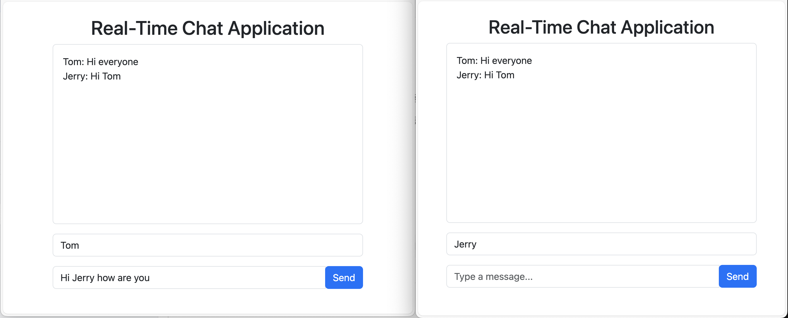

# Spring Boot Chat App

Source: [📺 YouTube: 6 Spring Boot Full Stack Projects For Beginners & Resume](https://www.youtube.com/watch?v=SDZk34mh7wM)

> Technologies:
> - Spring Boot
> - Thymeleaf
> - Websocket

## Demo

Open http://localhost:8080 by 2 browser windows and you can see this

You can use 2 windows for 2 people chating.

You can have your name in the 1st box. It won't delete after you send a message.

After Tom send a message, Jerry immediately receives it.

## Quick Start

Open the root folder of this project through __Intellij__ and run the Spring Boot backend