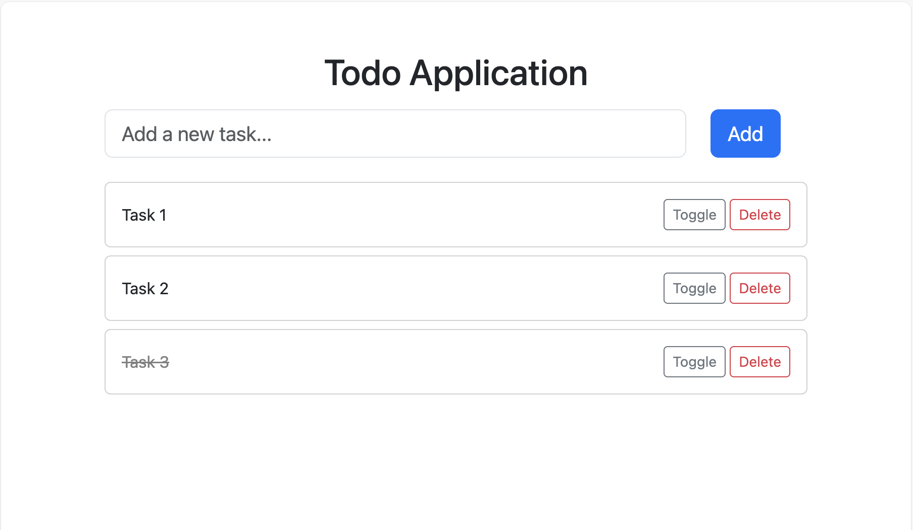
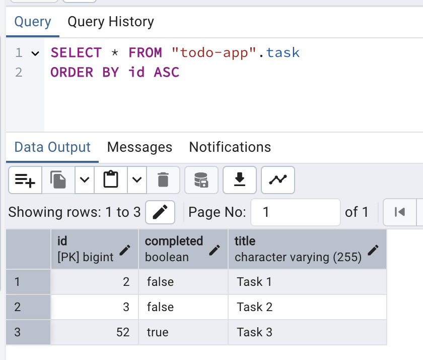

# Todo List App

Source: [📺 YouTube: 6 Spring Boot Full Stack Projects For Beginners & Resume](https://www.youtube.com/watch?v=SDZk34mh7wM)

> Technologies:
> - Spring Boot
> - Thymeleaf
> - Bootstrap CSS

## Demo

Open http://localhost:8080 by browser and you can see this

You can add tasks, delete a task, and toggle on and off for completion

You can also check data from PostgreSQL Database.

## Quick Start

1. Install PosgreSQL
2. Under "Login/Group Roles", add user "springboot_user" for our project use
3. Create Schema "todo-app" in local machine, grant access to "springboot_user"
4. Open the root folder of this project through __Intellij__ and run the Spring Boot backend
    - It should automatically create "task" table in Postgres DB