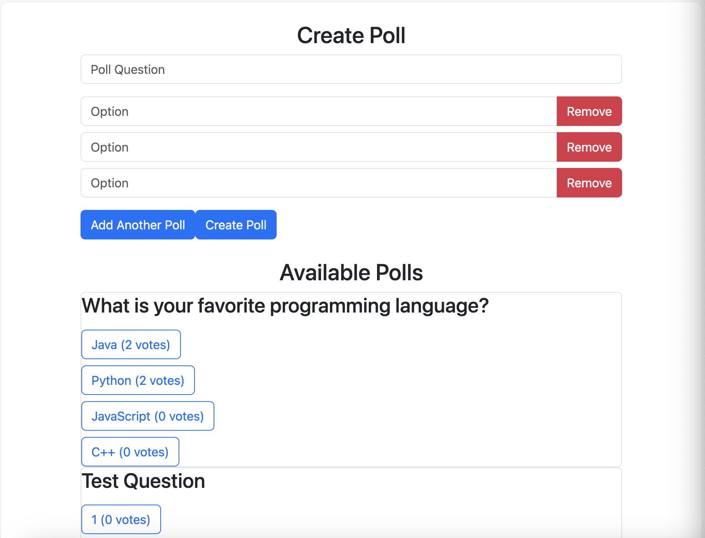
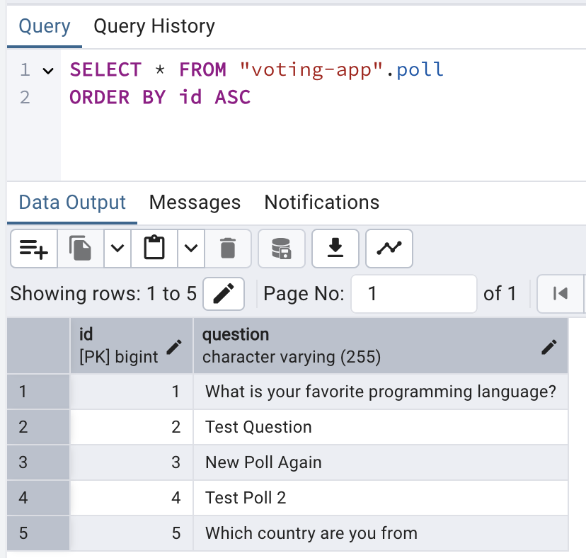
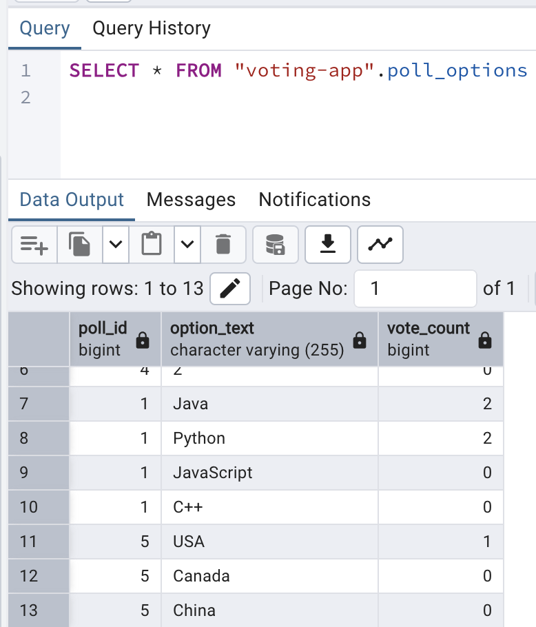

# Spring Boot Voting App

Source: [📺 YouTube: 6 Spring Boot Full Stack Projects For Beginners & Resume](https://www.youtube.com/watch?v=SDZk34mh7wM)

> Technologies:
> - Spring Boot
> - Angular
> - Bootstrap CSS
> - PostgreSQL

## Demo

Open http://localhost:4200 by browser and you can see this

You can add or remove as many options as you like by clicking `Add Another Poll` button.

By clicking `Create Poll` your new poll can be saved under "Available Polls".

In "Available Polls", you can click on the options to increase the votes.

You can also check data from PostgreSQL Database.

## Quick Start

1. Install PosgreSQL
2. Under "Login/Group Roles", add user "springboot_user" for our project use
3. Create Schema "voting-app" in local machine, grant access to "springboot_user"
4. Open the root folder of this project through __Intellij__ and run the Spring Boot backend
    - It should automatically create "poll" and "poll_options" tables in Postgres DB
5. Install __Nodejs__ and __Angular__
6. Using a Terminal and navigate to the `poll-app-frontend` directory, run `npm start`