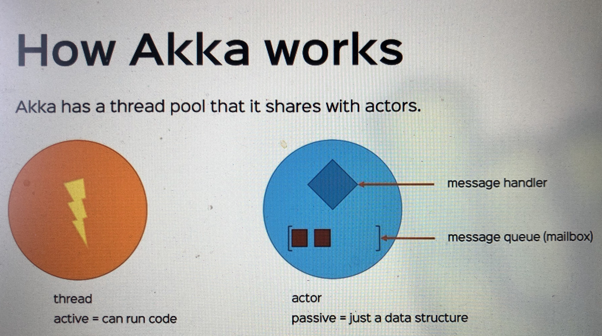
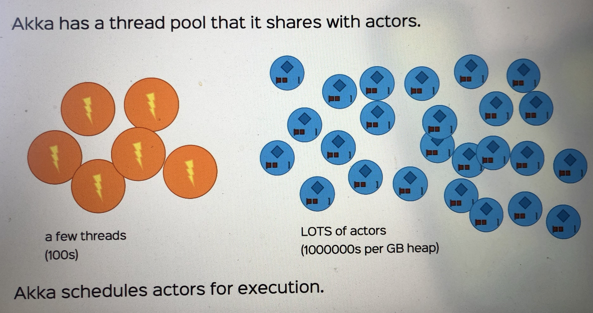
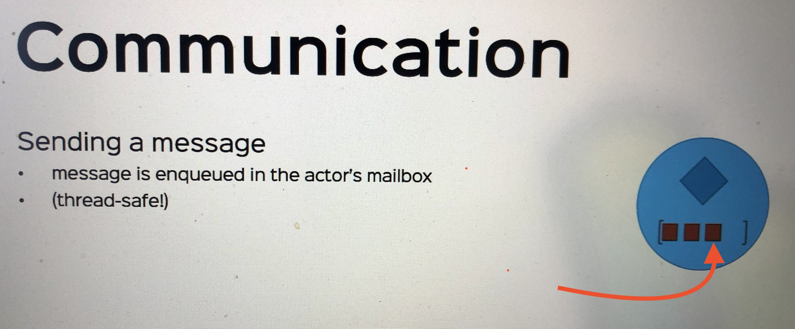
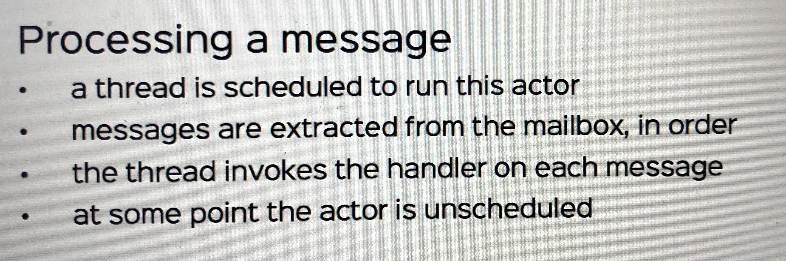
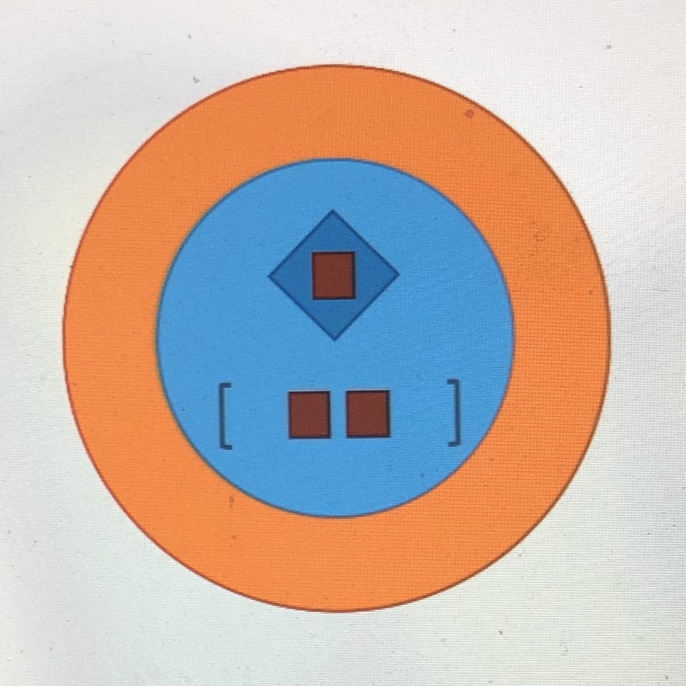

# How Actors Actually Work

> __Valid Questions__
> - Can we assume any ordering of messages? 
> - Aren't we causing race conditions?
> - What does "asynchronous" actually mean for actors?
> - How does this all work?!

⬆️ An actor is just a data structure, it needs a thread to run.

⬆️ Akka spawns a number of threads.
- These threads can handle a huge amount of actors

⬆️ At some point, the Akka thread's scheduler decides to unschedule this actor for execution
- The thread releases control of this actor, move on to do something else

## Guarantees

Only one thread operates on an actor at any time
- actors are effectively single-threaded
- <ins>no locks needed!</ins>
- additionally, the thread never release the actor in the middle of processing messages
  - processing messages is atomic

Message delivery guarantees
- at most once delivery
- <ins>for any sender-receiver pair, the message order is maintained</ins> (explain ⬇️)

> If Alice sends Bob message A followed by B
> - Bob will never receive duplicates of A or B
> - Bob will <ins>always</ins> receive A before B (possibly with some others in between)
