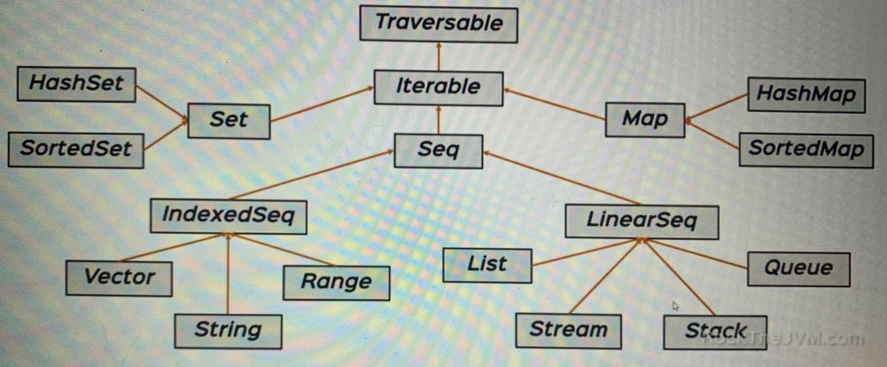
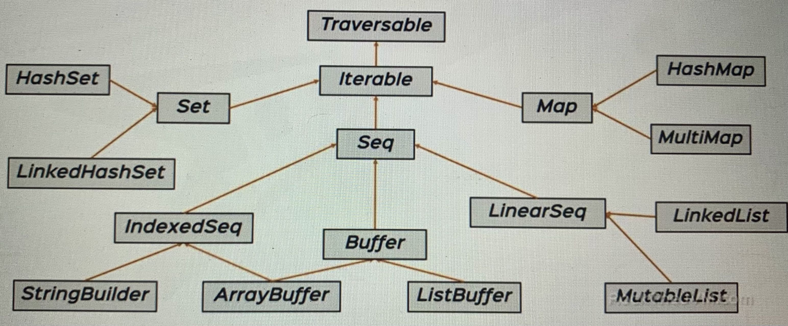

# A Collections Overview

## Overview
Scala offers both mutable and immutable collections:

- mutable colections can be updated in place
- imutable collections never change

We're using immutable collections by default
```scala
package object scala {
  type List[+A] = immutable.List[A]
}
```
```scala
object Predef {
  type Map[A, +B] = immutable.Map[A, B]
  type Set[A] = immutable.Set[A]
}
```
## Immutable Collections
Immutable collections are found in _scala.collections.immutable_ package


## Mutable Collections
Mutable collections are found in _scala.collections.mutable_ package



## Traversable

Base trait for all collections. Offers a great variety of methods:

- __maps__: _map, flatMap, collect_
- __conversions__: _toArray, toList, toSeq_
- __size info__: _isEmpty, size, nonEmpty_
- __tests__: _exists, forall_
- __folds__: _foldLeft, foldRight reduceLeft, reduceRight_
- __retrieval__: _head, find, tail_
- __string ops__: _mkString_